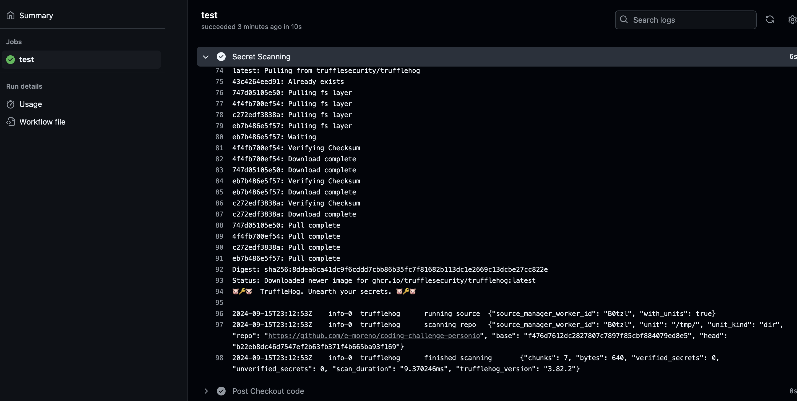

# Analysis of the Design

To secure the CI/CD pipeline for the VAmPI application, we will implement automated security checks using GitHub Actions. The focus will be on integrating Static Application Security Testing (SAST), Software Composition Analysis (SCA), and secret scanning to identify vulnerabilities early in the development process.

## Key Components:

### Static Application Security Testing (SAST):

#### Tools:
    Bandit and Semgrep.
#### Purpose:
    Analyze source code to detect security issues such as injection flaws, insecure configurations, and other common vulnerabilities.

### Software Composition Analysis (SCA):

#### Tool:
    Safety.
#### Purpose:
    Scan dependencies specified in requirements.txt for known vulnerabilities.

### Secret Scanning:

#### Tool:
    TruffleHog.
#### Implementation:
    Pre-commit Hooks:
    Use the pre-commit framework to set up TruffleHog hooks, preventing secrets from being committed.

    CI Integration:
    Run TruffleHog in the CI pipeline to catch any secrets that might have bypassed pre-commit checks.

## Pipeline Design:

### Trigger:
    The workflow will be triggered on pull requests to the main branch.
### Jobs:
    A single job named security_scans will run all security checks sequentially for simplicity.
#### Environment:
    Use the latest stable versions of tools and Python to ensure compatibility and up-to-date vulnerability databases.
### Failure Criteria:
    The pipeline will fail if any high or critical vulnerabilities are found, enforcing a security-first approach.
### Output:
    Detailed reports from each tool to aid in remediation efforts.

### Explanation of the Workflow Steps

#### Checkout code:
    Uses the actions/checkout@v3 action to clone the repository.
#### Set up Python:
    Sets up the Python environment using actions/setup-python@v4 with the latest Python 3.x version.
#### Install Dependencies and Tools:
    Upgrades pip, installs project dependencies from requirements.txt, and installs security tools (bandit, safety, truffleHog, semgrep).
#### Run Bandit:
    Executes Bandit to scan the codebase, focusing on high-severity and high-confidence issues.
#### Run Safety:
    Performs SCA using Safety, generating a full report of vulnerable dependencies.
#### Run Semgrep:
    Runs Semgrep using the recommended CI ruleset (p/ci), which includes a comprehensive set of security checks.
#### Run TruffleHog:
    Scans the repository for secrets and sensitive information.

### Notes

    continue-on-error: false: Ensures the workflow fails if any step detects vulnerabilities, enforcing strict security checks.
    Simplification: Combining all scans into a single job keeps the workflow clean and manageable.
    Semgrep Configuration: The p/ci configuration is a pre-defined set of rules suitable for CI environments, focusing on security best practices.

### Instructions for Developers

1. Clone the Repository

bash
Copy code
git clone https://github.com/yourusername/your-repo.git

2. Navigate to the Repository Directory

    ```bash
    cd your-repo
    ```

3. Install Pre-commit

    ```bash
    pip install pre-commit
    ```

4. Install the Pre-commit Hooks

    ```bash
    pre-commit install
    ```
    
    This command sets up the pre-commit hooks to run automatically before each commit.

5. (Optional) Run Pre-commit on All Files

    To check all files in the repository immediately (useful when setting up pre-commit for the first time), run:

    ```bash
    pre-commit run --all-files
    ```

6. Start Developing

    You can now work on the code as usual. Before each commit, the configured hooks will run to check for secrets, code issues, and more.

# Findings:




1. Bandit (Static Application Security Testing - SAST)

    Bandit scans Python code for security issues. In the context of VAmPI, Bandit can detect:

    Use of Hardcoded Credentials:

    Issue in VAmPI: Hardcoded API keys or passwords in the source code.
    Detection: Bandit flags instances where sensitive data is hardcoded.
    Insecure Use of eval and exec Functions:

    Issue in VAmPI: Usage of eval() with user-supplied input.
    Detection: Bandit identifies unsafe use of dynamic code execution functions.
    Insecure Randomness:

    Issue in VAmPI: Using the random module for cryptographic purposes.
    Detection: Bandit warns when random is used instead of secrets or os.urandom.
    Use of Weak Cryptographic Hash Functions:

    Issue in VAmPI: Employing MD5 or SHA1 for hashing sensitive data.
    Detection: Bandit detects usage of insecure hashing algorithms.
    OS Command Injections:

    Issue in VAmPI: Using os.system() or subprocess with unsanitized input.
    Detection: Bandit flags potential command injection vulnerabilities.

2. Semgrep (Static Application Security Testing - SAST)

    Semgrep uses customizable rules to find vulnerabilities. In VAmPI, Semgrep can detect:

    SQL Injection Vulnerabilities:

    Issue in VAmPI: Constructing SQL queries with user input without proper sanitization.
    Detection: Semgrep identifies patterns where user input is directly used in SQL statements.
    Cross-Site Scripting (XSS) in API Responses:

    Issue in VAmPI: API responses that include user input without proper encoding.
    Detection: Semgrep flags responses that may lead to reflected XSS attacks.
    Insecure Deserialization:

    Issue in VAmPI: Deserializing untrusted data using pickle or similar libraries.
    Detection: Semgrep detects unsafe deserialization practices.
    Missing Authentication Checks:

    Issue in VAmPI: Endpoints accessible without proper authentication.
    Detection: Semgrep finds routes lacking authentication decorators or checks.
    Use of Insecure HTTP Methods:

    Issue in VAmPI: Exposing dangerous HTTP methods (e.g., DELETE) without restrictions.
    Detection: Semgrep identifies route handlers that may need additional security controls.

3. Safety (Software Composition Analysis - SCA)

    Safety checks for known vulnerabilities in dependencies. In VAmPI, Safety can detect:

    Vulnerable Flask Versions:

    Issue in VAmPI: Using an outdated version of Flask with known security issues.
    Detection: Safety reports known CVEs associated with the Flask version used.
    Insecure Dependencies:

    Issue in VAmPI: Dependencies like PyYAML or Werkzeug with known vulnerabilities.
    Detection: Safety alerts about insecure versions of these packages.

4. TruffleHog (Secret Scanning)

    TruffleHog searches for secrets in the codebase. In VAmPI, TruffleHog can detect:

    Hardcoded API Keys and Tokens:

    Issue in VAmPI: API keys for third-party services embedded in the code.
    Detection: TruffleHog flags high-entropy strings and known secret patterns.
    Embedded Passwords:

    Issue in VAmPI: Plaintext passwords within the source code.
    Detection: TruffleHog identifies these patterns as potential secrets.
    Private Keys and Certificates:

    Issue in VAmPI: Inclusion of .pem or .key files.
    Detection: TruffleHog detects file types and contents indicative of private keys.
    Vulnerabilities in VAmPI Not Detected by the Pipeline and How to Identify Them

----

Some vulnerabilities in VAmPI require manual testing or specialized approaches. Below are these vulnerabilities and hints for the development team to identify them outside the pipeline.

1. Broken Object Level Authorization (BOLA)

    Description: Endpoints allow users to access or modify resources they shouldn't, due to insufficient authorization checks.

    How to Identify:

    Manual API Testing:

    Use tools like Postman or Insomnia to make API requests with IDs of resources owned by other users.
    Check if you can access or manipulate data not assigned to your user account.
    Code Review:

    Examine the code to ensure that authorization checks are in place for each resource access.

2. Mass Assignment

    Description: The application binds client-provided data to server-side objects without proper filtering, leading to unauthorized data manipulation.

    How to Identify:

    Testing with Additional Parameters:

    Send API requests with extra fields not intended to be modified by users (e.g., is_admin=true).
    Observe if the application accepts and processes these fields.
    Review Data Binding Logic:

    Ensure that the application explicitly defines which fields can be updated by the user.

3. Improper Rate Limiting

    Description: Lack of rate limiting allows attackers to perform brute-force attacks or overwhelm the API.

    How to Identify:

    Automated Request Flooding:

    Use scripts or tools like ab (Apache Benchmark) to send a high volume of requests.
    Check if the application enforces limits or continues to process all requests.
    Review Middleware and Configuration:

    Verify if rate limiting middleware (e.g., Flask-Limiter) is implemented.

4. Insecure JWT Handling

    Description: Issues with JSON Web Token (JWT) implementation, such as using weak signing algorithms or improper validation.

    How to Identify:

    Token Manipulation:

    Attempt to change the algorithm in the JWT header to none or downgrade to a weaker algorithm.
    See if the server accepts manipulated tokens.
    Code Analysis:

    Check how tokens are generated and validated.
    Ensure that tokens are properly signed and verified.

5. Cross-Origin Resource Sharing (CORS) Misconfigurations

    Description: Misconfigured CORS settings can expose the API to cross-origin attacks.

    How to Identify:

    CORS Testing:

    Use a web application to make cross-origin requests to the API.
    Check if responses contain wildcard Access-Control-Allow-Origin headers.
    Review CORS Policies:

    Ensure that only trusted origins are specified in the configuration.

6. Lack of Input Validation Leading to SSRF

    Description: The application processes user-supplied URLs or data without proper validation, allowing Server-Side Request Forgery.

    How to Identify:

    Input Testing:

    Input URLs pointing to internal resources (e.g., http://localhost/admin).
    Observe if the application fetches and returns data from these URLs.
    Review External Request Functions:

    Check where the application makes outbound requests based on user input.
    Implement whitelisting or strict validation.

7. Directory Traversal

    Description: The application allows users to access files outside the intended directories.

    How to Identify:

    Parameter Manipulation:

    Use ../ sequences in file paths to access sensitive files.
    Test endpoints that serve files or accept file paths.
    Code Inspection:

    Ensure that file access functions sanitize input paths.

8. Unrestricted File Uploads

    Description: Users can upload files without proper checks, potentially leading to code execution.

    How to Identify:

    File Upload Testing:

    Attempt to upload executable scripts or files with dangerous extensions.
    Check if the application stores and possibly executes these files.
    Review Upload Handling Code:

    Implement file type validation and store uploads outside the web root.

9. Improper Error Handling

    Description: Detailed error messages reveal sensitive information about the application.

    How to Identify:

    Error Induction:

    Cause errors by sending malformed requests.
    Observe if stack traces or debug information is returned.
    Configuration Review:

    Ensure that debug mode is disabled in production.
    Use generic error messages for users.

10. Use of Insecure or Deprecated Protocols

    Description: The application uses outdated protocols like HTTP instead of HTTPS.

    How to Identify:

    Network Traffic Analysis:

    Monitor network traffic to see if sensitive data is transmitted over HTTP.
    Use tools like Wireshark or Burp Suite.
    Configuration Check:

    Ensure the application enforces HTTPS and uses secure configurations.
    Additional Recommendations for the Development Team

    Implement Comprehensive Authorization Checks:

    Verify that every endpoint enforces proper authorization based on user roles and permissions.
    Enforce Strict Input Validation:

    Use allowlists to validate user input.
    Sanitize and encode data before processing.
    Enable Rate Limiting:

    Implement rate limiting to prevent abuse of API endpoints.
    Secure JWT Implementation:

    Use strong algorithms like HS256 or RS256.
    Validate tokens thoroughly on each request.
    Configure CORS Properly:

    Specify exact origins that are allowed to interact with the API.
    Avoid using wildcards in CORS headers.
    Sanitize File Paths and Uploads:

    Restrict file access to specific directories.
    Validate file types and scan uploads for malware.
    Handle Errors Securely:

    Disable detailed error messages in production.
    Log errors internally and provide generic messages to users.
    Use Secure Communication Protocols:

    Enforce HTTPS using TLS 1.2 or higher.
    Keep certificates up to date and configured correctly.
    Regular Security Training:

    Educate the team on common API vulnerabilities and secure coding practices.
    Perform Manual Code Reviews and Penetration Testing:

    Regularly review code for security issues not caught by automated tools.
    Engage professional security testers to perform in-depth assessments.


# Further improvements:

[TO-DO] Implementing DAST in CI/CD pipelines: I tried scanning with owasp zap, that conveniently offers a [github action](https://github.com/zaproxy/action-api-scan/tree/main) with a [packaged API scan](https://www.zaproxy.org/docs/docker/api-scan/).

When I tried locally, zap presented no findings, so I discarded the usage of this tool for now.
In order to implement it it would be run with: `./zap-api-scan.py -t openapi.yml -f openapi` having done a `docker cp Documents/external/challenge-per/coding-challenge-personio/openapi_specs/openapi3.yml <containerID>:/zap/wrk/openapi.yml` first.


